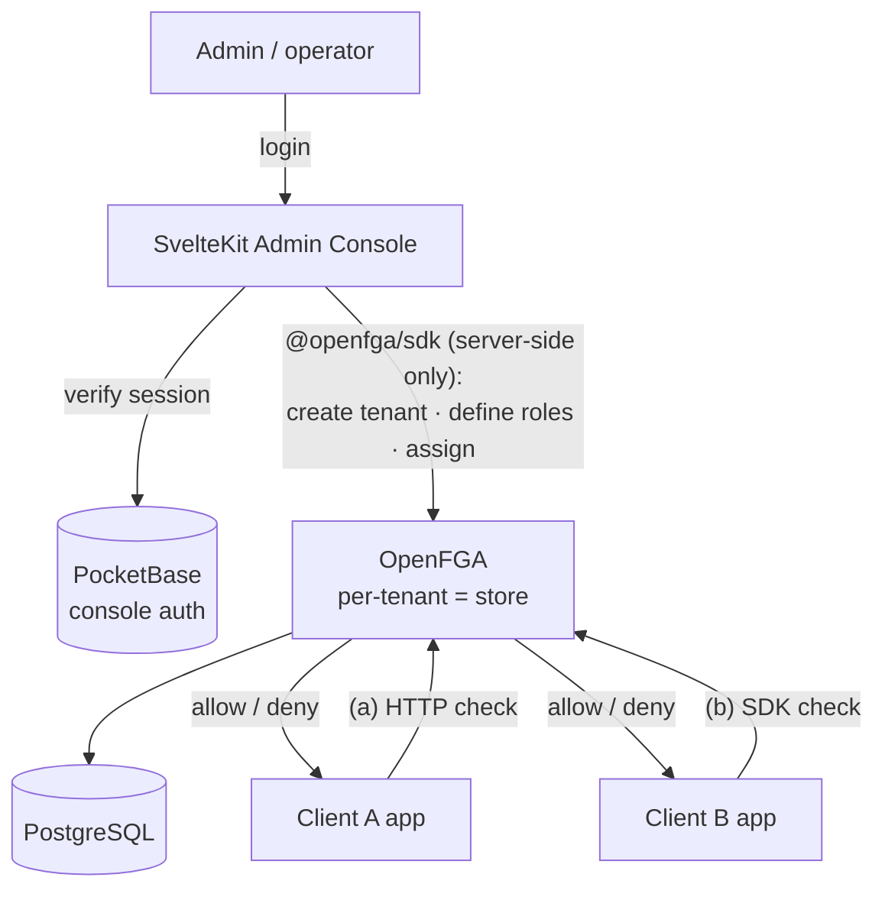

# RBAC Platform — Self-Hosted Multi-Tenant RBAC-as-a-Service

A minimal, self-hosted **authorization (RBAC) platform** that can onboard many client
organizations, each with **their own custom role vocabulary**, and answer
`can user X do action Y?` over an API.

- **Client A** defines roles like `Parent`, `Child`.
- **Client B** defines roles like `dev`, `qa`, `platform-engineer`.
- One deployment, many tenants, each isolated.

> This is an **authorization** service, not a login/identity service. The clients'
> own systems authenticate their users and then call this platform to check
> permissions.

**Design rationale:** see the [Decision Journal](docs/design/DECISION_JOURNAL.md) (full ADR-style
record) and the [Narrative](docs/product/NARRATIVE.md) (the problem→solution story). All docs are indexed in the **[docs hub](docs/README.md)**.

---

## How we work — Mini-AIDLC

This POC follows the **Mini-AIDLC** process (AI-driven development at POC speed).

- **Agent entry point:** [`AGENTS.md`](AGENTS.md) — how an AI agent (Kiro IDE, etc.) plugs into this repo and the process.
- **The model:** [`docs/reference/aidlc/KICKSTART.md`](docs/reference/aidlc/KICKSTART.md) — phase shape (`brainstorm → implement → verify → done`), human gate (nothing is "done" until the owner approves), decisions recorded.
- **Live state:** [`POC-LOG.md`](POC-LOG.md) — the single collapsed artifact (`§ Decisions / Now / Ideas / Shipped / Spec`). Decisions detail lives in [`docs/design/DECISION_JOURNAL.md`](docs/design/DECISION_JOURNAL.md); `POC-LOG.md § Decisions` indexes it.
- **Per-feature contracts:** template at [`docs/reference/aidlc/POC-SPEC.template.md`](docs/reference/aidlc/POC-SPEC.template.md); actual specs under [`docs/specs/`](docs/specs/).
- **Local setup:** [`docs/guides/development-guide.md`](docs/guides/development-guide.md) — pnpm + Podman + ports + deploy direction, keyed to the standard dev machine.
- **Graduation (POC → standard):** [`docs/reference/aidlc/MIGRATION.md`](docs/reference/aidlc/MIGRATION.md) + [`docs/reference/aidlc/skills/graduate/SKILL.md`](docs/reference/aidlc/skills/graduate/SKILL.md) — run `/graduate` **only** after the owner approves the POC for real development.

---

## The two "auths" — do not confuse them

| Concern | Handled by | What it protects |
|---|---|---|
| **Console admin login** (AuthN) | **PocketBase** | Who may log into *this* admin console (you / onboarding staff) |
| **Clients' end-user permissions** (AuthZ) | **OpenFGA** | The roles/permissions the platform manages *for the clients* |

They never overlap. PocketBase gates the console; OpenFGA holds the RBAC data.

---

## Architecture



- **Onboarding writes** (create tenant, define roles, assign users) go through the
  **SvelteKit console** using the OpenFGA Node SDK — server-side only, so the OpenFGA
  token never reaches the browser.
- **Runtime checks** are made by the clients directly against OpenFGA — either as
  plain **HTTP** *(mode a)* or via an **OpenFGA SDK** in their own stack *(mode b)*.
  Both hit the same `/check` API.

### Tenancy model

Each tenant (client organization) maps to **one OpenFGA store**. A store holds that
tenant's own **authorization model** (its role/permission schema) plus its
relationship tuples (which user has which role). This is what gives each client a
totally independent role vocabulary on a single shared platform.

---

## Components

| Service | Image / stack | Port | Purpose |
|---|---|---|---|
| `postgres` | `postgres:16` | 5432 | OpenFGA datastore |
| `openfga` | `openfga/openfga` | 8080 (HTTP), 8081 (gRPC), 3000 (playground) | Authorization engine |
| `pocketbase` | `ghcr.io/muchobien/pocketbase` | 8090 | Console admin auth |
| `console` | SvelteKit (Node 22) | 5173 (dev) / 3000 (prod) | Admin console UI + server |

---

## Quickstart

The fastest path uses [`just`](https://just.systems) — self-diagnosing, one command each.
Requirements: Podman (with `docker` routed to it) + Node ≥ 22. `just setup-local` installs
the rest and guides anything it can't.

```bash
just setup-local         # first run: install safe tools + deps, guide Podman, then audit
just start-local         # bring up Postgres + OpenFGA + PocketBase, wait until healthy
just setup-console-user  # create the console login (PB superuser + console user)
just seed-local-demo     # seed the demo tenants (Client A + Client B)
just dev                 # console at http://localhost:5173
```

Open http://localhost:5173 — you'll land on the public hero page; **Get started → sign
in**. In demo mode the login page offers a *Fill demo credentials* button
(`demo@example.com` / `demo123456`). The console has a **light/dark/auto theme switch**
in the header. Run `just` on its own to list every command.

> For a **clean state** to build your own demo by hand, use `just seed-local` instead
> of the demo seed. To verify the RBAC logic offline (no server): `cd console && pnpm verify:model`.

<details><summary>Without <code>just</code> (raw Docker Compose)</summary>

```bash
cp .env.example .env
docker compose up -d postgres openfga pocketbase   # routed to Podman
docker compose ps                                   # wait until healthy
# create the PocketBase superuser + a console user at http://localhost:8090/_/
cd console && pnpm install
OPENFGA_API_URL=http://localhost:8080 pnpm seed:local:demo
pnpm dev                                            # http://localhost:5173
```

Or run everything (including the console) via Compose: `docker compose up -d --build`.
</details>

See the **[docs hub](docs/README.md)** for everything, or jump to
**[docs/guides/demo-guide.md](docs/guides/demo-guide.md)** (full demo walkthrough) and
**[docs/design/CLIENT_INTEGRATION.md](docs/design/CLIENT_INTEGRATION.md)** (how a client calls the
`check` API, modes a & b).

---

## Repo layout

```
rbac-platform/
├── AGENTS.md                  # agent entry point (Mini-AIDLC process)
├── POC-LOG.md                 # live state (decisions · now · shipped)
├── justfile                   # local DX commands (just setup-local, start-local, …)
├── docker-compose.yml         # OpenFGA + Postgres + PocketBase + console
├── .env.example
├── scripts/                   # DX shell scripts (env-doctor, validate, setup, …)
├── docs/
│   ├── README.md              # docs hub (start here)
│   ├── product/               # NARRATIVE (the story) · ONE_PAGER (stub)
│   ├── design/                # DECISION_JOURNAL · CLIENT_INTEGRATION
│   ├── guides/                # DEVELOPMENT_GUIDE · DEMO
│   ├── specs/                 # per-feature POC specs
│   └── reference/aidlc/       # the Mini-AIDLC method + templates
└── console/                   # SvelteKit admin console
    ├── src/
    │   ├── lib/server/        # OpenFGA + PocketBase server-side integration
    │   └── routes/            # login, tenants, roles, assign, check
    └── scripts/
        ├── seed-core.ts       # shared seeding logic
        ├── seed-local.ts      # clean-state seed (one tenant, no users)
        ├── seed-local-demo.ts # demo-state seed (Client A + Client B)
        └── verify-model.ts    # offline RBAC decision-logic check
```

## License

Apache-2.0 (matches OpenFGA). See individual component licenses.
