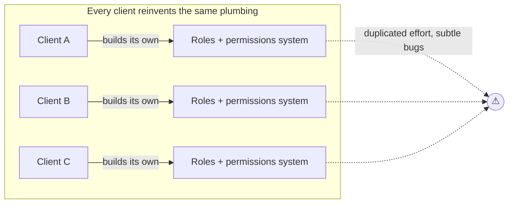
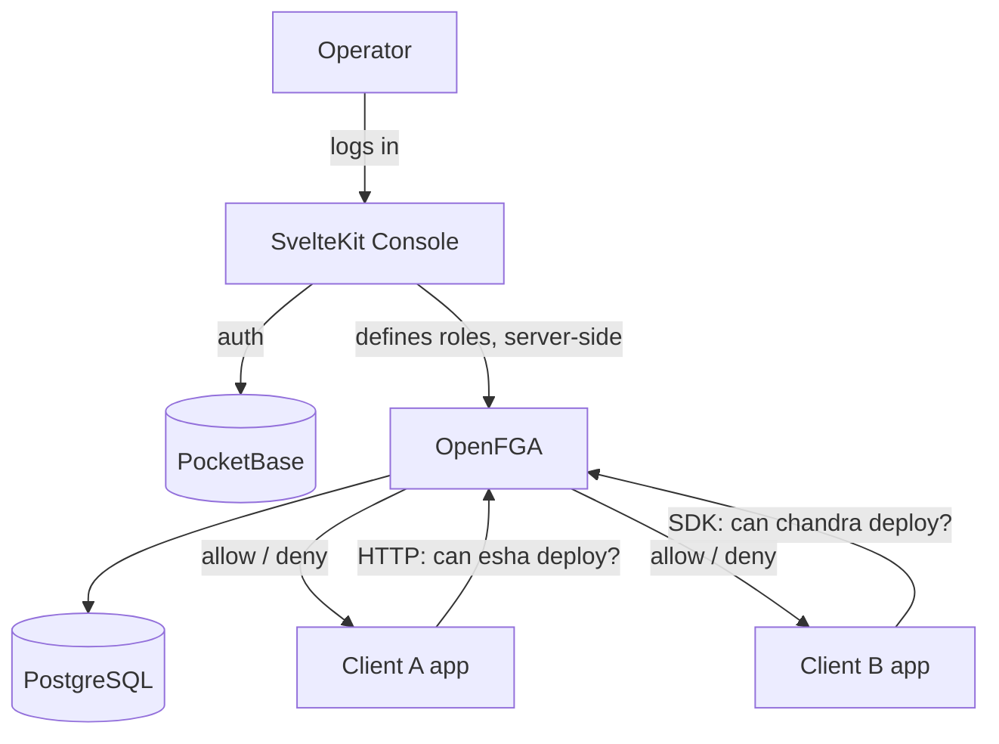
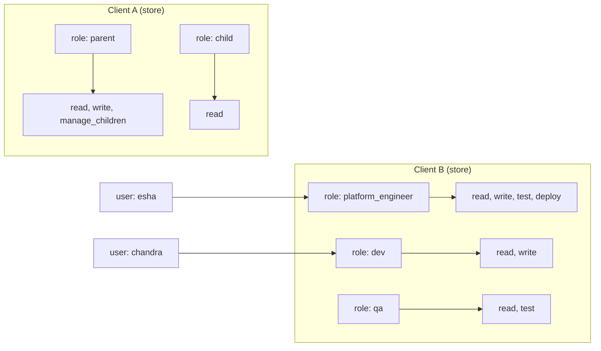

# Multi-Tenant RBAC-as-a-Service — Narrative

[README](../../README.md) › [Docs](../README.md) › Product › **Narrative**

> The **audience-facing story** of this POC. It does not restate technical rationale
> (that's [`DECISION_JOURNAL.md`](../design/DECISION_JOURNAL.md)) or live status (that's
> [`POC-LOG.md`](../../POC-LOG.md)) — it links to them. It is **living**: drafted at
> kickoff, reconciled to the implementation. It doubles as the **brief** for a
> downstream agent that turns it into a short animated explainer — see
> [§9](#9-animation-brief). Convention: [`POC-NARRATIVE.template.md`](../reference/aidlc/POC-NARRATIVE.template.md).

| Field | Value |
| :--- | :--- |
| **POC** | rbac-platform — self-hosted multi-tenant RBAC-as-a-Service |
| **One-line** | One self-hosted service that lets *any* client organization define *its own* roles and answer "can this user do this?" over an API. |
| **Audience** | A prospective client (and their engineers) who need to trust one platform to run *their* access rules. |
| **Status** | reconciled — core verified live, demo walkthrough owner-validated (2026-09-28); updated as new features land |
| **Companions** | Decisions → [`DECISION_JOURNAL.md`](../design/DECISION_JOURNAL.md) · Live state → [`POC-LOG.md`](../../POC-LOG.md) · Click-path → [`DEMO.md`](../guides/DEMO.md) |

---

## Table of Contents
1. [The Problem](#1-the-problem)
2. [Why It Matters](#2-why-it-matters--the-stakes)
3. [The Key Insight](#3-the-key-insight)
4. [The Solution in Plain Language](#4-the-solution-in-plain-language)
5. [How It Works (Visual Model)](#5-how-it-works--visual-model)
6. [The Running Example](#6-the-running-example)
7. [Walkthrough as Proof](#7-walkthrough-as-proof)
8. [What It Is / Isn't](#8-what-it-is--isnt)
9. [Animation Brief](#9-animation-brief)
10. [Change Log](#10-change-log-doc-vs-implementation)

---

## 1. The Problem

Every software company eventually has to answer one question, over and over:
**"Is this user allowed to do this?"** So each one builds its own roles-and-permissions
system from scratch. It's plumbing — not their product — but they build it anyway,
maintain it, and get it subtly wrong.

Now imagine you're a platform that serves *many* client organizations. Each client
wants **their own** vocabulary of roles. One client thinks in `Parent` and `Child`.
Another thinks in `dev`, `qa`, and `platform engineer`. You can't force them into one
shared scheme — and you *really* don't want to build and run a separate permission
system for each.

**Visual — the problem (before):**

## 2. Why It Matters — the stakes
- **Wasted effort:** every client rebuilds the same non-differentiating plumbing.
- **Security risk:** hand-rolled permission logic is where subtle, dangerous bugs hide.
- **No isolation:** a shared, one-size scheme leaks one client's structure into another's.
- **Slow onboarding:** adding a new client means bespoke work, not a config change.

## 3. The Key Insight

> **This is an *authorization* problem, not a *login* problem.** The question is "can
> user X do action Y?" — not "who is this user and what's their password?" Clients
> already handle login. They just need a clean answer to *can they*.

That one reframe rules out identity platforms (Auth0, Keycloak) and points straight at
a dedicated **authorization engine**. It's the beat everything else follows from.

## 4. The Solution in Plain Language

One self-hosted service. You onboard a client by creating their **own private space**
inside it. In that space, the client defines **their own roles** and what each role is
allowed to do — in their own words. Their app then asks the service a single question
at runtime — *"can this user do this?"* — and gets back **yes** or **no**.

No shared role scheme. No per-client rebuild. Each client is fully isolated, speaks
their own language, and consumes it as a plain API. A small **console** makes onboarding
roles a point-and-click task — nobody writes low-level rules by hand.

## 5. How It Works — Visual Model

**Visual — the solution (after):**

**The moving parts** (the *why* lives in the Decision Journal):
| Part | What it does | Decision |
| :--- | :--- | :--- |
| **OpenFGA** | The authorization engine — stores roles and answers checks | [ADR-2](../design/DECISION_JOURNAL.md) |
| **One store per tenant** | Each client's private, isolated space with its own roles | [ADR-3](../design/DECISION_JOURNAL.md) |
| **SvelteKit console** | Point-and-click role onboarding; keeps secrets server-side | [ADR-4](../design/DECISION_JOURNAL.md) |
| **PocketBase** | Logs the operator into the console | [ADR-6](../design/DECISION_JOURNAL.md) |
| **PostgreSQL + Compose** | Data store + one-command self-hosted run | [ADR-7](../design/DECISION_JOURNAL.md) |
| **`resource:_tenant`** | The tenant-wide resource classic checks run against | [ADR-11](../design/DECISION_JOURNAL.md) |

## 6. The Running Example

> **Two clients, totally different needs, one platform.**
> **Client A** speaks `Parent` / `Child`. **Client B** speaks `dev` / `qa` /
> `platform_engineer`. Same service, fully isolated, each with its own vocabulary.

We follow one person through the demo: **`esha`**, a platform engineer at Client B.
Ask *"can esha deploy?"* → **yes.** Ask the same of `chandra`, a developer → **no.**

**Visual — the example:**

## 7. Walkthrough as Proof

The demo *is* the proof. Each beat answers a claim from above.

| # | Show this | Proves |
| :-- | :--- | :--- |
| 1 | Two tenants on one platform — Client A and Client B | One service, many clients (§1) |
| 2 | Client A's roles are Parent/Child; Client B's are Dev/QA/Platform Engineer | Each client's *own* vocabulary, isolated (§4, ADR-3) |
| 3 | Test-a-check: `esha` + `deploy` → ✅; `chandra` + `deploy` → ⛔; `divya` + `test` → ✅ | The engine answers "can they?" correctly (§3) |
| 4 | Add a `viewer` role live, assign a user, check it | Self-service onboarding of arbitrary roles (§4) |
| 5 | The same check as a plain HTTP call | Consumed as an API by the client's own system (§4) |

→ Literal click-path with commands: [`DEMO.md`](../guides/DEMO.md).

## 8. What It Is / Isn't

| It IS | It is NOT |
| :--- | :--- |
| An **authorization** service (can user X do Y?) | An authentication / login service |
| **Self-hosted**, minimal ops (Postgres + 2 Go binaries + 1 app) | A heavy cloud identity platform |
| **Per-tenant** isolated role vocabularies | One shared, one-size role scheme |
| **Classic RBAC now**, object-level-ready later (no migration) | Locked into tenant-wide-only permissions |
| Consumed as a plain **API** (HTTP or SDK) | A UI-only tool |

## 9. Animation Brief
> Handoff to the downstream animation agent — everything it needs to make a short
> explainer from this doc, no codebase access required.

- **Target length:** 60–90 seconds.
- **Tone:** calm, confident, plain-spoken. No hype, no superlatives.
- **Through-line:** follow `esha` from §6 — "can esha deploy?" → yes; contrast with `chandra` → no.
- **Scene list** (each maps to a section):
  | Scene | Source § | Beat (what appears) | Voiceover seed |
  | :-- | :-- | :--- | :--- |
  | 1 | §1 | Three clients each rebuilding the same permission plumbing; a warning glows | "Every company keeps rebuilding the same thing: who's allowed to do what." |
  | 2 | §3 | The rebuilds collapse into one question mark: "can user X do action Y?" | "But it's really one question — not login, just: can they?" |
  | 3 | §5 | One service appears; two private spaces slot in, each with different role words | "One service. Each client gets their own space, their own words." |
  | 4 | §6–§7 | `esha` asks "can I deploy?" → green YES; `chandra` asks → red NO | "Their app just asks. The answer comes back — yes, or no." |
  | 5 | §4 | Same answer shown as a plain API call | "It's an API. Their system asks; ours answers." |
- **Assets provided:** the five Mermaid diagrams above (renderable to SVG), this doc,
  and a screen recording of the [`DEMO.md`](../guides/DEMO.md) click-path if available.
- **Prompt guidance:** use "authorization," avoid "login/identity." Keep the two-client
  contrast central. Do not imply cloud-hosting — it's self-hosted.
- **Do-not-say (honesty to status):** don't claim production-hardening (auth/TLS on the
  API and the gateway are still on the [`POC-LOG.md`](../../POC-LOG.md) § Ideas shelf).

## 10. Change Log (doc vs implementation)
- *(2026-09-28)* Drafted alongside the DX-foundation work; core solution already verified live (see POC-LOG § Shipped). Reflects `resource:_tenant` (ADR-11). To be reconciled as new features land.
- *(2026-09-28)* **Reconciled:** the §7 walkthrough was **owner-validated end-to-end** via `DEMO.md` (one-command setup + Client A/B checks resolving). Narrative matches the shipped implementation; no divergence to note.
