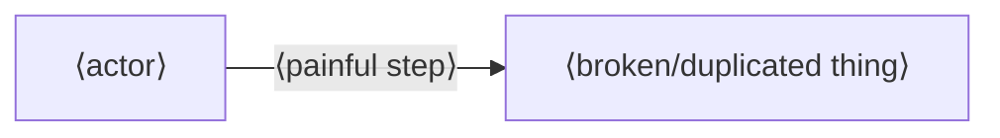

# ⟨POC name⟩ — Narrative

> **What this is.** The **audience-facing story** of a POC: the problem, the solution
> in plain language, a visual model, and the walkthrough that proves it. It is the
> *narrative spine* — it does **not** restate technical rationale (that lives in
> `DECISION_JOURNAL.md`) or live status (that lives in `POC-LOG.md`); it **links** to
> them.
>
> **Two audiences, one document:**
> 1. **A smart non-expert** — a stakeholder who needs to *get* the problem and why the
>    solution answers it, without domain jargon.
> 2. **A downstream animation agent** — a separate AI, outside this environment, that
>    turns this doc into a short animated explainer. So the doc is also a **brief**:
>    structured, scene-able, with explicit diagram specs (Mermaid) rather than prose
>    hand-waving. See [§9 Animation Brief](#9-animation-brief).
>
> **It is living.** Draft it at kickoff (before/alongside build). Reconcile it to the
> implementation at the end. The `Status` line tracks which.
>
> **Authoring rules for animation-readiness:**
> - Every major idea has a **visual** (a Mermaid diagram or a labelled before/after).
> - Write in **scenes**: each `§` is a beat the animation can render in order.
> - Prefer **one concrete example threaded throughout** over abstract description.
> - Keep sentences short and declarative — they may become voiceover lines.

| Field | Value |
| :--- | :--- |
| **POC** | ⟨name⟩ |
| **One-line** | ⟨the whole thing in one sentence⟩ |
| **Audience** | ⟨who must be convinced⟩ |
| **Status** | draft (pre-build) / building / **reconciled** (matches shipped) |
| **Companions** | Decisions → `DECISION_JOURNAL.md` · Live state → `POC-LOG.md` · Click-path → `DEMO.md` |

---

## Table of Contents
1. [The Problem](#1-the-problem)
2. [Why It Matters](#2-why-it-matters--the-stakes)
3. [The Key Insight](#3-the-key-insight)
4. [The Solution in Plain Language](#4-the-solution-in-plain-language)
5. [How It Works (Visual Model)](#5-how-it-works--visual-model)
6. [The Running Example](#6-the-running-example)
7. [Walkthrough as Proof](#7-walkthrough-as-proof)
8. [What It Is / Isn't](#8-what-it-is--isnt)
9. [Animation Brief](#9-animation-brief)
10. [Change Log](#10-change-log-doc-vs-implementation)

---

## 1. The Problem
> One or two short paragraphs. State the problem as the audience feels it — the pain,
> not the tech. No solution yet.

⟨…⟩

**Visual — the problem (before):**


## 2. Why It Matters — the stakes
> Why should anyone care? What breaks / costs / risks if this stays unsolved?
- ⟨stake 1⟩
- ⟨stake 2⟩

## 3. The Key Insight
> The single reframe that unlocks the solution. Often "this looks like X but is really
> Y." One or two sentences. This is usually the most important beat in the animation.

> **Insight:** ⟨…⟩

## 4. The Solution in Plain Language
> Describe the solution as the *answer to §1*, in words a non-expert understands.
> No implementation detail yet — that's §5.

⟨…⟩

## 5. How It Works — Visual Model
> Now the mechanism, still visual-first. This is the core "solution" diagram the
> animation will build up piece by piece.

**Visual — the solution (after):**
```mermaid
flowchart TD
  ⟨actor⟩ -->|⟨action⟩| ⟨system⟩
  ⟨system⟩ --> ⟨outcome⟩
```

**The moving parts** (link the *why* to the Decision Journal, don't restate it):
| Part | What it does | Decision |
| :--- | :--- | :--- |
| ⟨component⟩ | ⟨plain role⟩ | ⟨ADR-n⟩ |

## 6. The Running Example
> One concrete example, threaded through the whole story and the demo. Make it vivid
> and specific — the animation will follow this exact example.

⟨e.g. "Two clients, totally different needs, one platform: Client A speaks
Parent/Child; Client B speaks dev/qa/platform-engineer."⟩

**Visual — the example:**
```mermaid
flowchart LR
  ⟨example nodes⟩
```

## 7. Walkthrough as Proof
> The demo *is* the proof. List the exact beats you'll show, each tied to a claim from
> §1–§5. This section is the bridge to `DEMO.md` (the literal click-path).

| # | Show this | Proves |
| :-- | :--- | :--- |
| 1 | ⟨action in the app⟩ | ⟨which claim⟩ |
| 2 | ⟨action⟩ | ⟨claim⟩ |

→ Literal click-path with commands: [`demo-guide.md`](../../guides/demo-guide.md).

## 8. What It Is / Isn't
> Kills misunderstanding fast — the audience's likely wrong assumptions, corrected.

| It IS | It is NOT |
| :--- | :--- |
| ⟨…⟩ | ⟨common misread⟩ |

## 9. Animation Brief
> The handoff to the downstream animation agent. Everything it needs to produce a
> short explainer from this doc — no access to the codebase required.

- **Target length:** ⟨e.g. 60–90s⟩
- **Tone:** ⟨e.g. calm, confident, plain-spoken; no hype⟩
- **Through-line:** the one example from §6, start to finish.
- **Scene list** (maps to sections; each is a beat):
  | Scene | Source § | Beat (what appears) | Voiceover seed (1 line) |
  | :-- | :-- | :--- | :--- |
  | 1 | §1 | ⟨the problem visual⟩ | ⟨…⟩ |
  | 2 | §3 | ⟨the insight⟩ | ⟨…⟩ |
  | 3 | §5 | ⟨solution diagram builds up⟩ | ⟨…⟩ |
  | 4 | §7 | ⟨the proof / demo moment⟩ | ⟨…⟩ |
- **Assets provided:** the Mermaid diagrams above (renderable to SVG), this doc, and
  ⟨screenshots / recording of `DEMO.md` if available⟩.
- **Prompt guidance for the agent:** ⟨constraints — brand words to use/avoid, must-keep
  claims, anything that must NOT be over-claimed given `POC-LOG.md` status⟩.
- **Do-not-say:** ⟨claims not yet true — keep the film honest to current status⟩.

## 10. Change Log (doc vs implementation)
> Because this doc is living: note when the narrative was reconciled to what actually
> shipped, so the animation is built from truth, not the original pitch.

- *(⟨date⟩)* Drafted pre-build.
- *(⟨date⟩)* Reconciled to implementation: ⟨what changed vs the draft⟩.
